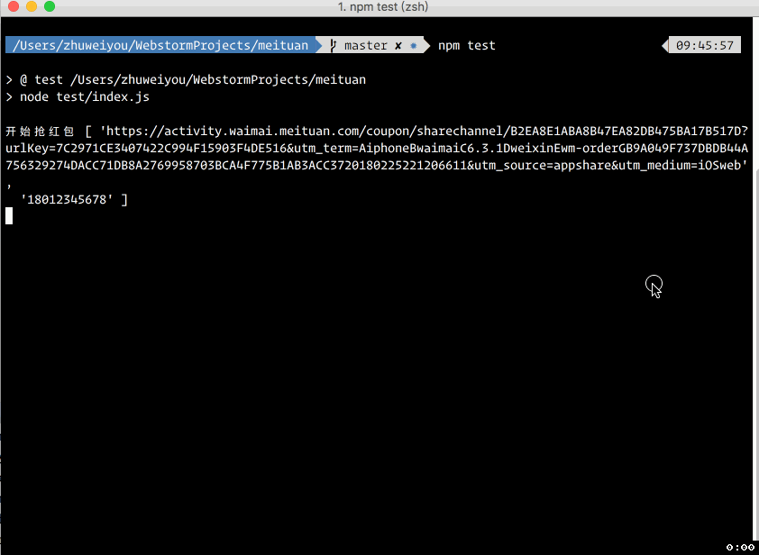

# meituan

[](LICENSE)

**一键领取美团手气最佳红包**

由于美团的红包领取次数是跟着微信账号走的，无法像饿了么红包那样无限领取

我们微信号有限，目前只开源了领取逻辑，没有做成在线服务，请自行下载使用

> 仅供学习交流之用，请勿用于非法用途，否则产生的一切后果自行承担

## 开发与使用

### 环境

建议安装 Node.js 9.x 以上

### 安装依赖

```bash
npm i
```

### 抓包获取 cookies

分别使用 N 个小号登录微信，打开红包页面，抓包后复制 cookie `ewxinfo`

填写到 [meituan/cookies.js](meituan/cookies.js) 中，最好 20 个微信

### 测试领取逻辑

```bash
npm test
```

### 开发环境，跑 web 服务

```bash
npm run dev
```

### 生产环境

```bash
npm start # 首次
npm run reload # 更新
```

## 运行效果

[](.github/screenshots.gif)
